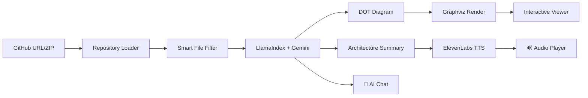

<div align="center">

# 🏗️ CodeAtlas

### AI-Powered Codebase Visualization & Understanding

**Transform any GitHub repository into beautiful architecture diagrams with voice narration and AI chat — powered by MCP**

[](https://huggingface.co/spaces/MCP-1st-Birthday/CodeAtlas)
[](https://gradio.app)
[](https://modelcontextprotocol.io)
[](https://llamaindex.ai)
[](https://ai.google.dev)
[](https://openai.com)
[](https://elevenlabs.io)
[](https://modal.com)

**[📺 Demo Video](#-demo-video)** • **[🔗 Try it Live](https://huggingface.co/spaces/MCP-1st-Birthday/CodeAtlas)** • **[📱 Social Post](https://x.com/your-post-link)**

</div>

---

## 🎬 Demo Video

https://github.com/user-attachments/assets/YOUR_VIDEO_ID

> *Watch CodeAtlas analyze the Flask repository in real-time, generate architecture diagrams, and explain the codebase with voice narration.*

---

## 📸 Screenshots

<table>
<tr>
<td width="50%">

### 🏠 Generate Page

*Enter a GitHub URL or upload a ZIP file*

</td>
<td width="50%">

### 🗺️ Architecture Diagram

*AI-generated architecture visualization*

</td>
</tr>
<tr>
<td width="50%">

### 📜 History & Layout Panel

*Browse past diagrams and adjust layout options*

</td>
<td width="50%">

### 💬 AI Chat & Voice

*Chat with AI and listen to voice narration*

</td>
</tr>
</table>

---

## 🌟 What is CodeAtlas?

**CodeAtlas** is your AI-powered codebase companion that instantly visualizes and explains any software architecture. Simply paste a GitHub URL, and within seconds get:

- 🗺️ **Beautiful Architecture Diagrams** — AI-generated Graphviz visualizations showing components, layers, and relationships
- 🔊 **Voice Narration** — Listen to AI explain your codebase architecture (powered by ElevenLabs)
- 💬 **AI Chat** — Ask questions and get intelligent answers about the code
- 🤖 **MCP Integration** — Use with Claude Desktop, Cursor, or any MCP-compatible client

**Perfect for:** Code reviews, onboarding new developers, documentation, learning new frameworks, and understanding legacy codebases.

---

## ✨ Key Features

| Feature | Description | Technology |
|---------|-------------|------------|
| 🔗 **GitHub Analysis** | Paste any public repo URL and analyze instantly | GitHub API + Smart Filtering |
| 📁 **ZIP Upload** | Upload local codebases for private analysis | File Processing |
| 🗺️ **Architecture Diagrams** | AI-generated Graphviz diagrams with layers, clusters, and relationships | **Graphviz** + Gemini AI |
| 🔊 **Voice Narration** | Natural speech explanation of your architecture | **🎙️ ElevenLabs TTS** |
| 💬 **AI Chat** | Context-aware Q&A about your codebase | **🦙 LlamaIndex** RAG |
| 🤖 **Multi-Model Support** | Choose between Gemini 3.0 Pro, 2.5 Pro/Flash, or GPT-5.1/5 Mini | **Google Gemini** + **OpenAI** |
| 📐 **Interactive Layout** | Real-time diagram adjustments (direction, spacing, zoom) | Graphviz DOT |
| 📜 **Diagram History** | Browse and reload previous analyses | Local Storage |
| 🔌 **MCP Server** | 4 tools for AI agent integration | **FastMCP** |
| ☁️ **Cloud Ready** | One-command serverless deployment | **Modal** |

---

## 🔌 MCP Server Integration

CodeAtlas is a **native MCP server** — connect it to Claude Desktop, Cursor, or any MCP client to analyze codebases directly from your AI assistant!

### Available MCP Tools

| Tool | Description |
|------|-------------|
| `analyze_codebase` | Generate architecture diagram from GitHub URL or file path |
| `get_architecture_summary` | Get detailed text summary of codebase architecture |
| `chat_with_codebase` | Ask questions about any codebase |
| `list_recent_analyses` | List recently analyzed repositories |

### Connect to Claude Desktop

Add this to your Claude Desktop config (`~/Library/Application Support/Claude/claude_desktop_config.json`):

```json
{
  "mcpServers": {
    "codeatlas": {
      "url": "https://your-deployment.modal.run/gradio_api/mcp/sse"
    }
  }
}
```

Then ask Claude: *"Analyze the architecture of github.com/pallets/flask using CodeAtlas"*

---

## 🛠️ Tech Stack & Library Integrations

CodeAtlas integrates **6 major sponsor technologies** for a comprehensive solution:

| Layer | Technology | Prize Category |
|-------|------------|----------------|
| **🎨 UI Framework** | [**Gradio 6**](https://gradio.app) — Multi-page routing, `mcp_server=True` | Core Hackathon |
| **🦙 AI Framework** | [**LlamaIndex**](https://llamaindex.ai) — Unified LLM interface, RAG | **$1K LlamaIndex Prize** |
| **✨ Primary AI** | [**Google Gemini**](https://ai.google.dev) — Gemini 3.0 Pro, 2.5 Pro/Flash | **$10K Gemini Credits** |
| **🤖 Alternate AI** | [**OpenAI**](https://openai.com) — GPT-5.1, GPT-5 Mini/Nano | **ChatGPT Pro + $1K Credits** |
| **🎙️ Voice TTS** | [**ElevenLabs**](https://elevenlabs.io) — High-quality voice narration | **~$2K + AirPods Pro** |
| **☁️ Deployment** | [**Modal**](https://modal.com) — Serverless cloud, auto-scaling | **$2.5K Modal Prize** |
| **🔌 MCP Protocol** | [**FastMCP**](https://github.com/jlowin/fastmcp) — Model Context Protocol | Core MCP Track |

### Integration Architecture

```
┌──────────────────────────────────────────────────────────────────────────────────┐
│                              🏗️ CodeAtlas Architecture                           │
├──────────────────────────────────────────────────────────────────────────────────┤
│                                                                                  │
│  ┌─────────────────────────────────────────────────────────────────────────────┐ │
│  │                           USER INTERFACE LAYER                              │ │
│  │  ┌──────────────┐   ┌──────────────┐   ┌──────────────┐                    │ │
│  │  │   Gradio 6   │   │  MCP Server  │   │   FastAPI    │                    │ │
│  │  │  (Multi-page)│   │  (4 Tools)   │   │  (Health)    │                    │ │
│  │  └──────┬───────┘   └──────┬───────┘   └──────────────┘                    │ │
│  └─────────┼──────────────────┼───────────────────────────────────────────────┘ │
│            │                  │                                                  │
│            ▼                  ▼                                                  │
│  ┌─────────────────────────────────────────────────────────────────────────────┐ │
│  │                           AI PROCESSING LAYER                               │ │
│  │  ┌──────────────┐   ┌──────────────┐   ┌──────────────┐                    │ │
│  │  │  🦙 LlamaIndex│──▶│ Gemini 3.0   │   │   GPT-5.1    │                    │ │
│  │  │  (Unified AI) │   │ Pro/2.5 Flash│   │   Mini/Nano  │                    │ │
│  │  └──────┬───────┘   └──────────────┘   └──────────────┘                    │ │
│  └─────────┼────────────────────────────────────────────────────────────────────┘ │
│            │                                                                      │
│            ▼                                                                      │
│  ┌─────────────────────────────────────────────────────────────────────────────┐ │
│  │                           OUTPUT & SERVICES LAYER                           │ │
│  │  ┌──────────────┐   ┌──────────────┐   ┌──────────────┐                    │ │
│  │  │  Graphviz    │   │ 🎙️ ElevenLabs│   │   GitHub     │                    │ │
│  │  │  (Diagrams)  │   │   (Voice)    │   │   (Loader)   │                    │ │
│  │  └──────────────┘   └──────────────┘   └──────────────┘                    │ │
│  └─────────────────────────────────────────────────────────────────────────────┘ │
│                                                                                  │
│  ┌─────────────────────────────────────────────────────────────────────────────┐ │
│  │                           DEPLOYMENT LAYER                                  │ │
│  │                    ☁️ Modal (Serverless, Auto-scaling)                      │ │
│  └─────────────────────────────────────────────────────────────────────────────┘ │
└──────────────────────────────────────────────────────────────────────────────────┘
```

---

## 🚀 Quick Start

### Prerequisites
- Python 3.10+
- Graphviz (`brew install graphviz` on macOS, `apt install graphviz` on Linux)

### Option 1: Run Locally

```bash
# Clone and setup
git clone https://github.com/yourusername/CodeAtlas.git
cd CodeAtlas
python -m venv .venv && source .venv/bin/activate
pip install -r requirements.txt

# Run
python app.py
```

Open http://localhost:7860 and go to **Settings** to add your API keys.

### Option 2: Use Makefile

```bash
make install  # Create venv and install dependencies
make run      # Run the application
```

### Option 3: Deploy to Hugging Face Spaces + Modal Backend

**For the hackathon submission**, we use:
- **HF Space**: Runs the Gradio UI (required for hackathon)
- **Modal Backend**: Provides compute endpoints (eligible for $2.5K Modal prize)

```bash
# 1. Deploy Modal backend first
pip install modal && modal setup
modal deploy modal_backend.py
# Note your endpoint URLs

# 2. Push to HF Spaces
# Set MODAL_BACKEND_URL secret in your HF Space settings
# pointing to your Modal deployment URL
```

### Option 4: Deploy Full App to Modal (Standalone)

```bash
# Deploy the complete app on Modal
modal deploy modal_app.py
```

Your app will be live at `https://your-modal-url.modal.run` 🚀

---

## ⚙️ Configuration

Configure API keys via the **Settings** page in the UI:

| Key | Required | Purpose | Get Key |
|-----|----------|---------|---------|
| **Gemini API Key** | ✅ Yes | Primary AI engine | [aistudio.google.com/apikey](https://aistudio.google.com/apikey) |
| **OpenAI API Key** | Optional | GPT-5.1/5 Mini/Nano models | [platform.openai.com/api-keys](https://platform.openai.com/api-keys) |
| **ElevenLabs API Key** | Optional | Voice narration | [elevenlabs.io/app/developers](https://elevenlabs.io/app/developers/api-keys) |

---

## 📁 Project Structure

```
CodeAtlas/
├── app.py                  # 🚀 Main entry point
├── modal_app.py            # ☁️ Modal cloud deployment
├── server.py               # 🔌 MCP server entry
├── requirements.txt        # 📦 Dependencies
├── Makefile                # 🛠️ Build commands
│
├── src/
│   ├── config.py           # ⚙️ Configuration & settings
│   │
│   ├── core/               # 🧠 Core analysis engine
│   │   ├── analyzer.py     # LlamaIndex + Gemini/OpenAI
│   │   ├── diagram.py      # Graphviz rendering
│   │   └── repository.py   # GitHub/ZIP processing
│   │
│   ├── integrations/       # 🔗 External services
│   │   ├── elevenlabs.py   # ElevenLabs TTS client
│   │   └── voice.py        # Audio generation pipeline
│   │
│   ├── mcp/                # 🤖 MCP Protocol
│   │   ├── server.py       # FastMCP server
│   │   └── tools.py        # 4 MCP tools
│   │
│   └── ui/                 # 🎨 Gradio interface
│       ├── app.py          # Multi-page routes
│       ├── components.py   # Reusable UI components
│       └── styles.py       # Custom CSS
│
└── data/
    ├── diagrams/           # 📊 Generated DOT files
    ├── audios/             # 🔊 Generated audio files
    └── logs/               # 📝 Application logs
```

---

## 🔍 How It Works



1. **📥 Load Repository** — Download from GitHub or extract ZIP, smart-filter to relevant code files (excludes node_modules, tests, configs)
2. **🧠 AI Analysis** — LlamaIndex processes code context with Gemini 3.0 Pro (or GPT-5.1) to understand architecture
3. **🗺️ Generate Diagram** — AI creates Graphviz DOT code with 15-20 key nodes showing layers, clusters, and relationships
4. **🔊 Voice Narration** — AI generates natural summary, ElevenLabs converts to high-quality speech
5. **💬 Chat Interface** — Context-aware Q&A about the analyzed codebase with conversation history

---

## 🎯 Use Cases

| Scenario | How CodeAtlas Helps |
|----------|---------------------|
| **🆕 Onboarding** | New team members instantly understand codebase structure |
| **📝 Documentation** | Generate architecture diagrams for README/docs |
| **🔍 Code Review** | Visualize PR changes in context of overall architecture |
| **📚 Learning** | Understand how popular open-source projects are structured |
| **🏚️ Legacy Code** | Make sense of undocumented older codebases |
| **🤖 AI Agents** | Give Claude/Cursor AI ability to analyze any repo via MCP |

---

## 🏆 Hackathon Submission

This project is submitted to **MCP's 1st Birthday Hackathon** hosted by Anthropic and Gradio.

- **Track:** MCP in Action → Consumer
- **Tags:** `mcp-in-action-track-consumer`
- **Team:** Solo

### Sponsor Integrations

| Sponsor | Integration | Feature |
|---------|-------------|---------|
| 🦙 **LlamaIndex** | `llama-index-core`, `llama-index-llms-gemini`, `llama-index-llms-openai` | Unified AI interface, RAG support |
| ✨ **Google Gemini** | `google-genai`, Gemini 3.0 Pro, 2.5 Pro/Flash | Primary AI analysis engine |
| 🤖 **OpenAI** | `openai`, GPT-5.1, GPT-5 Mini/Nano | Alternative AI model support |
| 🎙️ **ElevenLabs** | `elevenlabs` | Voice narration TTS |
| ☁️ **Modal** | `modal` | Serverless cloud deployment |
| 🔌 **FastMCP** | `fastmcp`, `mcp` | MCP protocol server |

---

## 👨‍💻 Author

**Your Name**
- GitHub: [@yourusername](https://github.com/yourusername)
- HuggingFace: [@yourusername](https://huggingface.co/yourusername)
- Twitter/X: [@yourhandle](https://x.com/yourhandle)

---

## 📜 License

MIT License — see [LICENSE](LICENSE) for details.

---

<div align="center">

**Built with ❤️ for MCP's 1st Birthday Hackathon 🎂**

*November 2025*

[](https://github.com/yourusername/CodeAtlas)

</div>
