<div align="center">

# 🏗️ CodeAtlas

### AI-Powered Codebase Visualization & Understanding

**Transform any GitHub repository into beautiful architecture diagrams with voice narration and AI chat — powered by MCP**

[](https://huggingface.co/spaces/MCP-1st-Birthday/CodeAtlas)
[](https://gradio.app)
[](https://modelcontextprotocol.io)
[](https://llamaindex.ai)
[](https://ai.google.dev)
[](https://openai.com)
[](https://elevenlabs.io)
[](https://modal.com)

**[🔗 Try it Live](https://huggingface.co/spaces/MCP-1st-Birthday/CodeAtlas)** • **[📺 Demo Video](#-demo-video)** • **[📱 Twitter Post](https://x.com/aghilsabu/status/1995249175336997350?s=20)** • **[💼 LinkedIn Post](https://www.linkedin.com/posts/aghilsabu_codeatlas-ai-powered-codebase-visualization-share-7401015482310393857-vHRg)**

</div>

---

## 🎬 Demo Video

[](https://youtu.be/J8dcTLzNgpE)

**[▶️ Watch on YouTube](https://youtu.be/J8dcTLzNgpE)**

> *Watch CodeAtlas analyze a GitHub repository in real-time, generate architecture diagrams, and explain the codebase with voice narration.*

---

## 📸 Screenshots

<table>
<tr>
<td width="50%">

### 1️⃣ Generate Page

*Enter a GitHub URL or upload a ZIP file*

</td>
<td width="50%">

### 2️⃣ Loading Diagram

*AI analyzing and generating architecture*

</td>
</tr>
<tr>
<td width="50%">

### 3️⃣ Generated Layout with Graph

*AI-generated architecture visualization*

</td>
<td width="50%">

### 4️⃣ Explore Tab - History & Layout Tools

*Left sidebar with history load options and layout tools*

</td>
</tr>
<tr>
<td width="50%">

### 5️⃣ Explore Tab - Audio & Chat

*Right sidebar with ElevenLabs audio summary and chat*

</td>
<td width="50%">

### 6️⃣ Settings Page

*API keys for Gemini, ChatGPT, ElevenLabs and AI model dropdown*

</td>
</tr>
</table>

---

## 🌟 What is CodeAtlas?

**CodeAtlas** is your AI-powered codebase companion that instantly visualizes and explains any software architecture. Simply paste a GitHub URL, and within seconds get:

- 🗺️ **Beautiful Architecture Diagrams** — AI-generated Graphviz visualizations showing components, layers, and relationships
- 🔊 **Voice Narration** — Listen to AI explain your codebase architecture (powered by ElevenLabs)
- 💬 **AI Chat** — Ask questions and get intelligent answers about the code
- 🤖 **MCP Integration** — Use with Claude Desktop, Cursor, or any MCP-compatible client

**Perfect for:** Code reviews, onboarding new developers, documentation, learning new frameworks, and understanding legacy codebases.

---

## ✨ Key Features

| Feature | Description | Technology |
|---------|-------------|------------|
| 🔗 **GitHub Analysis** | Paste any public repo URL and analyze instantly | GitHub API + Smart Filtering |
| 📁 **ZIP Upload** | Upload local codebases for private analysis | File Processing |
| 🗺️ **Architecture Diagrams** | AI-generated Graphviz diagrams with layers, clusters, and relationships | **Graphviz** + Gemini AI |
| 🔊 **Voice Narration** | Natural speech explanation of your architecture | **🎙️ ElevenLabs TTS** |
| 💬 **AI Chat** | Context-aware Q&A about your codebase | **🦙 LlamaIndex** RAG |
| 🤖 **Multi-Model Support** | Choose between Gemini 3.0/2.5 Pro/Flash or GPT-5.1/5 Mini | **Google Gemini** + **OpenAI** |
| 📐 **Interactive Layout** | Real-time diagram adjustments (direction, spacing, zoom) | Graphviz DOT |
| 📜 **Diagram History** | Browse and reload previous analyses | Local Storage |
| 🔌 **MCP Server** | 4 tools for AI agent integration | **FastMCP** |
| ☁️ **Cloud Ready** | One-command serverless deployment | **Modal** |

---

## 🔌 MCP Server Integration

CodeAtlas exposes **4 MCP tools** for AI agent integration:

| Tool | Description |
|------|-------------|
| `analyze_codebase` | Generate architecture diagram from GitHub URL |
| `get_architecture_summary` | Get text summary of codebase architecture |
| `chat_with_codebase` | Ask questions about any codebase |
| `list_recent_analyses` | List recently analyzed repositories |

**MCP Endpoint:** `https://huggingface.co/spaces/MCP-1st-Birthday/CodeAtlas/gradio_api/mcp/sse`

---

## 🛠️ Tech Stack

CodeAtlas integrates multiple technologies for a comprehensive solution:

| Layer | Technology | Purpose |
|-------|------------|---------|
| **🎨 UI Framework** | [**Gradio 6**](https://gradio.app) | Multi-page routing, `mcp_server=True` |
| **🦙 AI Framework** | [**LlamaIndex**](https://llamaindex.ai) | Unified LLM interface, RAG |
| **✨ Primary AI** | [**Google Gemini**](https://ai.google.dev) | Gemini 3.0 Pro, 2.5 Pro/Flash |
| **🤖 Alternate AI** | [**OpenAI**](https://openai.com) | GPT-5.1, GPT-5 Mini/Nano |
| **🎙️ Voice TTS** | [**ElevenLabs**](https://elevenlabs.io) | High-quality voice narration |
| **☁️ Backend API** | [**Modal**](https://modal.com) | Serverless API endpoints |
| **🔌 MCP Protocol** | [**FastMCP**](https://github.com/jlowin/fastmcp) | Model Context Protocol |

---

## 📁 Project Structure

```
codeAtlas/
├── app.py                  # Main Gradio application entry point
├── modal_backend.py        # Modal serverless API deployment
├── requirements.txt        # Python dependencies
├── Makefile               # Build and run commands
├── src/
│   ├── config.py          # Configuration management
│   ├── core/
│   │   ├── analyzer.py    # AI-powered codebase analysis
│   │   ├── diagram.py     # Graphviz diagram generation
│   │   └── repository.py  # GitHub/ZIP repository loading
│   ├── integrations/
│   │   ├── elevenlabs.py  # ElevenLabs TTS integration
│   │   ├── modal_client.py # Modal API client
│   │   └── voice.py       # Voice synthesis utilities
│   ├── mcp/
│   │   ├── server.py      # FastMCP server setup
│   │   └── tools.py       # MCP tool definitions
│   └── ui/
│       ├── app.py         # UI layout and routing
│       ├── components.py  # Reusable UI components
│       └── styles.py      # CSS styling
├── data/
│   ├── diagrams/          # Generated diagram files
│   ├── audios/            # Voice narration files
│   └── logs/              # Application logs
└── assets/
    └── screenshots/       # Documentation screenshots
```

---

## 🚀 Quick Start

### Prerequisites
- Python 3.10+
- Graphviz (`brew install graphviz` on macOS, `apt install graphviz` on Linux)

### Option 1: Run Locally

```bash
# Clone and setup
git clone https://github.com/aghilsabu/codeAtlas.git
cd codeAtlas
python -m venv .venv && source .venv/bin/activate
pip install -r requirements.txt

# Run
python app.py
```

Open http://localhost:7860 and go to **Settings** to add your API keys.

### Option 2: Use Makefile

```bash
make install  # Create venv and install dependencies
make run      # Run the application
```

### Option 3: Deploy API Backend to Modal

```bash
# Deploy the serverless API backend on Modal
modal deploy modal_backend.py
```

**Modal Backend API Endpoints:**
| Endpoint | URL |
|----------|-----|
| Health Check | `https://aghilsabu--codeatlas-backend-health.modal.run` |
| Generate Diagram | `https://aghilsabu--codeatlas-backend-generate-diagram.modal.run` |
| Generate Voice | `https://aghilsabu--codeatlas-backend-generate-voice.modal.run` |
| Analyze Codebase | `https://aghilsabu--codeatlas-backend-analyze-codebase.modal.run` |

These serverless endpoints handle heavy compute operations and can be called from any frontend! 🚀

---

## ⚙️ Configuration

Configure API keys via the **Settings** page in the UI:

| Key | Required | Purpose | Get Key |
|-----|----------|---------|---------|
| **Gemini API Key** | ✅ Yes | Primary AI engine | [aistudio.google.com/apikey](https://aistudio.google.com/apikey) |
| **OpenAI API Key** | Optional | GPT-5.1/5 Mini models | [platform.openai.com/api-keys](https://platform.openai.com/api-keys) |
| **ElevenLabs API Key** | Optional | Voice narration | [elevenlabs.io/app/developers](https://elevenlabs.io/app/developers/api-keys) |

---

## 🔍 How It Works

```mermaid
flowchart LR
    A[GitHub URL/ZIP] --> B[Repository Loader]
    B --> C[Smart File Filter]
    C --> D[LlamaIndex + Gemini]
    D --> E[DOT Diagram]
    E --> F[Graphviz Render]
    F --> G[Interactive Viewer]
    
    D --> H[Architecture Summary]
    H --> I[ElevenLabs TTS]
    I --> J[🔊 Audio Player]
    
    D --> K[💬 AI Chat]
```



1. **📥 Load Repository** — Download from GitHub or extract ZIP, smart-filter to relevant code files (excludes node_modules, tests, configs)
2. **🧠 AI Analysis** — LlamaIndex processes code context with Gemini 3.0 (or GPT-5.1) to understand architecture
3. **🗺️ Generate Diagram** — AI creates Graphviz DOT code with 15-20 key nodes showing layers, clusters, and relationships
4. **🔊 Voice Narration** — AI generates natural summary, ElevenLabs converts to high-quality speech
5. **💬 Chat Interface** — Context-aware Q&A about the analyzed codebase with conversation history

---

## 🎯 Use Cases

- **Onboarding** — New team members instantly understand codebase structure
- **Documentation** — Generate architecture diagrams for README/docs  
- **Code Review** — Visualize changes in context of overall architecture
- **Learning** — Understand how popular open-source projects are structured
- **Legacy Code** — Make sense of undocumented older codebases

---

## 👨‍💻 Author

**Aghil Sabu**
- GitHub: [@aghilsabu](https://github.com/aghilsabu)
- HuggingFace: [@aghilsabu](https://huggingface.co/aghilsabu)
- Twitter/X: [@AghilSabu](https://x.com/AghilSabu)

---

## 📜 License

MIT License — see [LICENSE](LICENSE) for details.

---

<div align="center">

**Built with ❤️ for MCP's 1st Birthday Hackathon 🎂**

*November 2025*

[](https://github.com/aghilsabu/codeAtlas)

</div>
